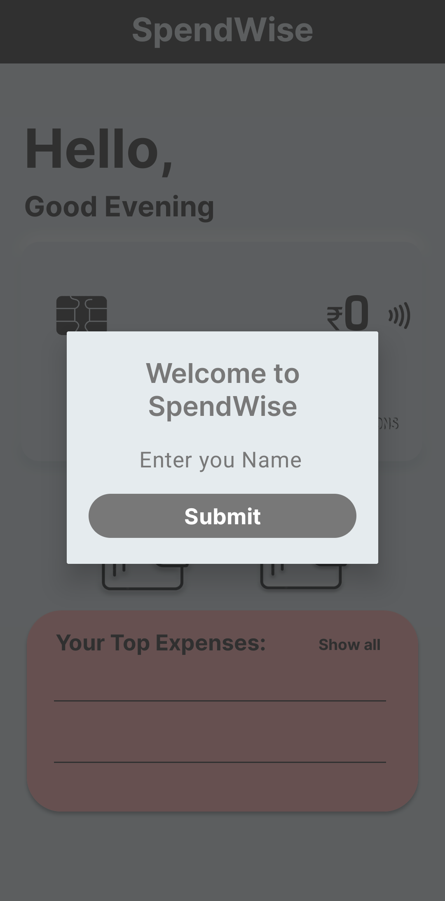

 

  

  <h3 align="center">SpendWise</h3>

  

    "Empower Your Wallet with SpendWise: Where Every Expense Finds its Place!"
     
     
  

## Table Of Contents

* [About the Project](#about-the-project)
* [Built With](#built-with)
* [Getting Started](#getting-started)
  * [Prerequisites](#prerequisites)
  * [Installation](#installation)
* [Authors](#authors)

## About The Project

SpendWise is an innovative Java Android application designed to empower users in managing their finances effectively. With its intuitive interface, users can effortlessly track their expenses by inputting transactions, starting with their initial budget. By offering a seamless experience to store and categorize expenditures, SpendWise enables users to gain a clear understanding of their spending patterns, make informed financial decisions, and ultimately achieve better control over their finances.

## Built With

SpendWise is crafted using a synergy of cutting-edge technologies. It harnesses the power of **Java**, serving as the backbone of the Android application, ensuring robust functionality and an intuitive user interface. Developed within **Android Studio**, this IDE is pivotal in designing, coding, and rigorously testing the app, guaranteeing a seamless user experience. **SQLite Database** seamlessly manages user transaction data, securely organizing expenditures. The user interface is meticulously constructed using **XML**, adhering to the principles of **Material Design** for a modern and cohesive visual language. Additionally, the app prioritizes an optimal **User Experience (UX)**, implementing responsive design and efficient data handling to ensure effortless navigation. This harmonious amalgamation of technologies culminates in SpendWise's ability to provide a secure, user-friendly, and empowering expense management solution.Here are a few examples.

## Getting Started

Fork the project and run using Android Studio IDE to run on its emulators.

### Prerequisites

Android Device with API more level more than 25 or android version above Oreo. 

### Installation

Go to this link download the APK and install and use 
 
You may have to accept certain security warnings before installing the application.

https://www.upload-apk.com/en/MbgnVoxdmJ5VJeg

### Creating A Pull Request

1. Fork the Project
2. Create your Feature Branch
3. Commit your Changes 
4. Push to the Branch
5. Open a Pull Request

## Authors

* **Akash Srivastava** - *2nd Year Computer Science Student* - [Akash Srivastava](https://github.com/aCash9) - *Sole Developer*
* **Harsh Vardhan** - *2nd Year Electronics and Communications Student* - [Harsh Vardhan](https://github.com/HvGaur) - *Design Collaburator*
